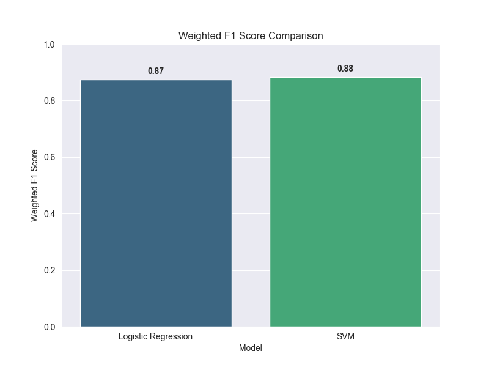
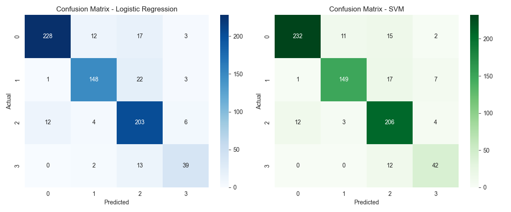

# 📑 Informe Final del Proyecto

## 1. Introducción
Este proyecto aborda el problema de **clasificación de textos** a partir de títulos y resúmenes de artículos.  
El objetivo principal es comparar diferentes modelos de *machine learning* para determinar cuál ofrece el mejor desempeño, tomando como métrica principal el **F1 Score ponderado**.

---

## 2. Metodología

### 2.1 Conjunto de datos
- **Fuente:** [challenge_data-18-ago.csv]  
- **Número de instancias:** 3565 documentos  
- **Número de clases:** 4 categorías  
- **Preprocesamiento:**  
  - No contaba con datos faltantes o nulos.
  - No contaba con datos duplicados.
  - No contenia caracteres especiales, puesto que estos no existen en el idioma inglés.
  - Se convirtió todo el texto a minúsculas.
  - Las etiquetas fueron codificadas usando `MultiLabelBinarizer`.
  - Para la vectorizacion de las palabras se usó **TF-IDF**, con un máximo de 5000 características y los stopwords prederteminados para el idioma inglés.

### 2.2 Modelos entrenados
- **Logistic Regression (OneVsRestClassifier)**  
  - Hiperparámetros: `max_iter=1000`, `class_weight='balanced'`  
- **SVM (LinearSVC, OneVsRestClassifier)**  
  - Hiperparámetros: `C=1.0`, `max_iter=1000`, `class_weight='balanced'`  

---

## 3. Experimentos y Resultados

### 3.1 Métricas de evaluación
Se utilizaron las siguientes métricas:  
- Precisión (Precision)  
- Exhaustividad (Recall)  
- F1-Score ponderado (**métrica principal**)  
- Matriz de confusión  

### 3.2 Resultados comparativos

| Modelo                | Precision (Weighted) | Recall (Weighted) | F1-Score (Weighted) |
|------------------------|----------------------|-------------------|---------------------|
| Logistic Regression    | 0.90                 | 0.85              | **0.87**            |
| SVM (LinearSVC)        | 0.91                 | 0.86              | **0.88**            |

### 3.3 Visualizaciones
**Comparación del F1 Score ponderado:**  

**Matriz de confusión:**  

---

## 4. Discusión y Reflexiones
- La **Regresión Logística** fue probada sin clases balanceadas y aunque la precision fue alta, los resultados obtenidos para recall fueron bastante bajos, lo que indica que el modelo no es capaz de identificar correctamente las clases minoritarias. Al probarse con clases balanceadas, se obtuvo un mejor desempeño en todas las métricas.
- El **SVM** mostró un rendimiento consistente al ser probado con y sin clases balanceadas, las diferencias son minimas en las metricas.  
- El uso de **TF-IDF** permitió una representación efectiva, pero carece de semántica profunda.  

---

## 5. Conclusiones
- El modelo con mejor desempeño para identificar clases minoritarias fue: **[SVM]**.  
- El **F1 Score ponderado** confirma la robustez del modelo frente a clases desbalanceadas.   

---

